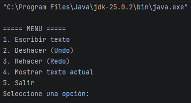
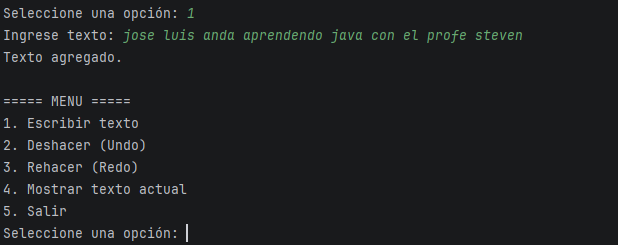
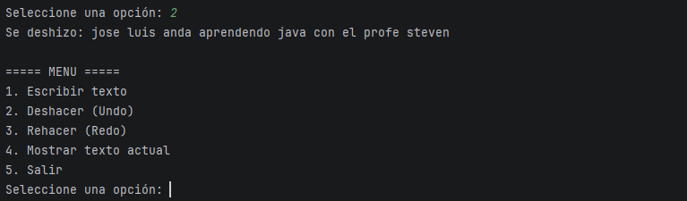
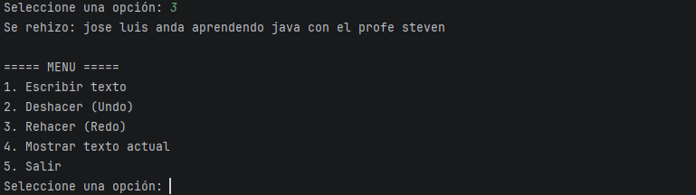
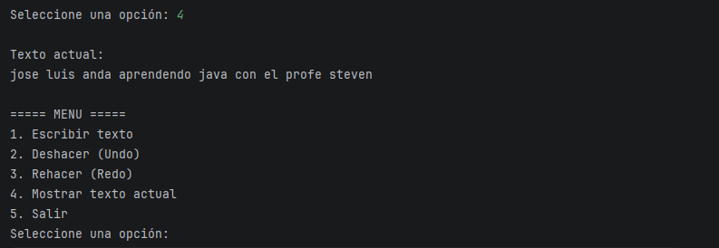
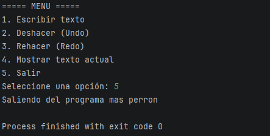

# EA1.2 Actividad - Pilas (Stack)

## Descripción del proyecto

Este proyecto consiste en la implementación de una estructura de datos tipo pila (Stack) en Java y su aplicación en un simulador simple de deshacer (Undo) y rehacer (Redo) similar al que utilizan los editores de texto.

El programa permite escribir texto desde la consola, deshacer acciones y rehacerlas utilizando dos pilas.

---

## Objetivo

Comprender el funcionamiento de la estructura de datos pila (Stack) y aplicarla en un simulador de deshacer (Undo) y rehacer (Redo) implementado en Java.

---

## Concepto de pila (Stack)

Una pila (Stack) es una estructura de datos lineal que funciona bajo el principio LIFO (Last In, First Out). Esto significa que el último elemento que entra en la pila es el primero en salir.

Un ejemplo sencillo es una pila de platos: el último plato que se coloca es el primero que se retira.

### Operaciones principales de una pila

push(): inserta un elemento en la pila  
pop(): elimina el elemento que se encuentra en la parte superior  
peek(): muestra el elemento superior sin eliminarlo  
isEmpty(): verifica si la pila está vacía

---

## Aplicación en el simulador Undo / Redo

El programa utiliza dos pilas para gestionar las acciones del usuario.

Pila principal: almacena las acciones que el usuario va realizando.

Pila de deshacer (redo): almacena las acciones que fueron deshechas para poder restaurarlas.

Funcionamiento general:

1. Cuando el usuario escribe texto, se guarda en la pila principal.
2. Cuando el usuario usa Undo, el último elemento pasa de la pila principal a la pila de redo.
3. Cuando el usuario usa Redo, el elemento vuelve de la pila de redo a la pila principal.

---

## Funcionalidades del programa

El programa ofrece un menú en consola con las siguientes opciones:

1. Escribir texto
2. Deshacer la última acción
3. Rehacer la acción deshecha
4. Mostrar texto actual
5. Salir del programa

---

## Estructura del proyecto

EA1-Actividad-Pilas-Java

src  
Stack.java  
Editor.java  
Main.java

README.md

### Descripción de las clases

Stack.java  
Implementa la estructura de pila con las operaciones push, pop, peek e isEmpty.

Editor.java  
Contiene la lógica del simulador de escribir texto, deshacer y rehacer usando dos pilas.

Main.java  
Contiene el menú en consola que permite al usuario interactuar con el programa.

---

## Ejecución del programa

1. Clonar el repositorio.
2. Abrir el proyecto en IntelliJ IDEA.
3. Ejecutar el archivo Main.java.
4. Usar el menú en consola para interactuar con el programa.

---

## Capturas de ejecución

capturas del programa funcionando.

---

## Autor

José Luis Alzate Quiroz
